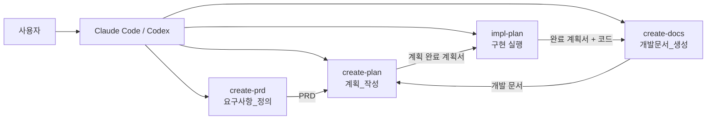

# project-helper — 글로벌 아키텍처 가이드

## 시스템 개요

`project-helper`는 Claude Code와 Codex에서 함께 쓰는 플러그인이다. 기술적 문제의 해법을 사용자가 직접 설계하도록 돕는 것이 목적이며, AI는 답을 대신 내놓지 않고 질문·조사·기록을 맡는다.

실행 코드는 없다. 스킬 정의와 참조 문서, 양식으로 이루어진 마크다운과, 산출물의 형식을 검사하는 셸 스크립트 세 편이 전부다. 네 스킬은 요구사항 확정부터 계획, 구현, 문서화까지 한 방향으로 이어지지만 서로의 파일을 읽지 않는다. 스킬 사이를 잇는 것은 PRD와 계획서라는 산출물뿐이다.

## 도메인 구성

계획서의 도메인 구조를 그대로 옮긴 여섯 개다. 스킬 하나에 도메인 하나가 대응하지 않는다. `계획_관리`와 `스킬_실행_맥락`은 여러 스킬에 걸치는 규칙을 담고, `배포와_설치`는 스킬을 담은 껍데기를 담당한다.

| 도메인 | 책임 | 문서 |
| --- | --- | --- |
| 계획_작성(create-plan) | 요구사항을 질의응답으로 좁혀 구현 계획서로 남긴다 | [`도메인_문서/계획_작성(create-plan)/`](도메인_문서/계획_작성%28create-plan%29/01_도메인_개요.md) |
| 계획_관리(plan-management) | 계획서의 세 층 구조, 상태 전이, 표기, 추가 작업의 반영 기준 | [`도메인_문서/계획_관리(plan-management)/`](도메인_문서/계획_관리%28plan-management%29/01_도메인_개요.md) |
| 스킬_실행_맥락(skill-trigger) | 스킬 발동 조건과 대화 맥락의 유지·종료·인계 | [`도메인_문서/스킬_실행_맥락(skill-trigger)/`](도메인_문서/스킬_실행_맥락%28skill-trigger%29/01_도메인_개요.md) |
| 요구사항_정의(create-prd) | 제품 단위의 목적과 요구사항을 PRD 한 편으로 확정한다 | [`도메인_문서/요구사항_정의(create-prd)/`](도메인_문서/요구사항_정의%28create-prd%29/01_도메인_개요.md) |
| 개발문서_생성(create-docs) | 구현 결과를 세 층 구조의 개발 문서로 남긴다 | [`도메인_문서/개발문서_생성(create-docs)/`](도메인_문서/개발문서_생성%28create-docs%29/01_도메인_개요.md) |
| 배포와_설치(distribution) | 두 환경의 매니페스트, 배포 대상 판정, 로컬 재설치 | [`도메인_문서/배포와_설치(distribution)/`](도메인_문서/배포와_설치%28distribution%29/01_도메인_개요.md) |

`impl-plan` 스킬은 독립된 도메인을 갖지 않는다. 그 실행 절차는 계획서 형식을 소비하는 쪽이므로 `계획_관리`가, 발동과 인계 규칙은 `스킬_실행_맥락`이 함께 다룬다.

### 도메인 간 통신

호출이 아니라 파일과 대화 맥락으로 이어진다. 스킬끼리 서로를 호출하는 경로는 없다.

| 호출자 | 피호출자 | 방식 | 목적 |
| --- | --- | --- | --- |
| 요구사항_정의 | 계획_작성 | PRD 파일 | 확정된 요구사항을 계획의 입력으로 넘긴다 |
| 계획_작성 | 계획_관리 | 계획서 형식 | 세 층 구조와 상태 표기를 따른다 |
| 계획_관리 | 개발문서_생성 | 계획서의 단계 값 | 단계가 `완료`여야 문서화에 진입한다 |
| 개발문서_생성 | 계획_작성 | 개발 문서 파일 | 다음 계획의 준비 단계가 이 문서를 읽는다 |
| 스킬_실행_맥락 | 네 도메인 전부 | frontmatter와 실행 원칙 | 어느 스킬이 켜지고 언제 넘길지 정한다 |
| 배포와_설치 | 네 도메인 전부 | 설치본 | 스킬 파일을 두 환경에 전달한다 |

## 기술 스택

| 계층 | 사용 기술 | 비고 |
| --- | --- | --- |
| 실행 환경 | Claude Code, Codex | 두 환경이 같은 스킬 디렉터리를 읽는다 |
| 스킬 정의 | Markdown + YAML frontmatter | `name`과 `description`이 발동을 좌우한다 |
| 검증 도구 | Bash 스크립트 3편 | `set -euo pipefail`로 동작한다 |
| 검색 도구 | `rg`(ripgrep), `grep`, `find`, `sed` | 계획서 검증은 `rg`, PRD와 문서 검증은 `grep`을 쓴다 |
| 다이어그램 | Mermaid | 개발 문서의 관계도와 구성도 |
| 버전 관리 | Git | 구현 항목 하나가 커밋 하나 |

런타임이나 패키지 의존성은 없다. 설치본에 들어가는 것은 마크다운과 셸 스크립트뿐이다.

## 인프라

배포 단위는 마켓플레이스 저장소 하나이며, 실행 환경은 사용자의 로컬 CLI다. 서버도 데이터베이스도 없다.

| 항목 | 내용 |
| --- | --- |
| 배포 방식 | 저장소 루트를 마켓플레이스로 등록하고 플러그인을 설치한다. 두 환경 모두 `.claude-plugin/marketplace.json`을 읽는다 |
| 환경 구분 | 개발용 로컬 설치와 마켓플레이스 설치 두 가지. 스테이징이나 운영 환경은 없다 |
| 설치 위치 | Claude Code는 `~/.claude/plugins/marketplaces/<이름>/`, Codex는 `~/.codex/plugins/cache/helpers/project-helper` |
| 배포 대상 | `plugins/project-helper/`의 `.claude-plugin`, `.codex-plugin`, `skills`만 복사된다 |
| 개발용 파일 | `docs/project-helper/`, `evals/`, `README.md`, `CLAUDE.md`, `AGENTS.md`는 설치본에 들어가지 않는다 |
| 로그와 모니터링 | 해당 없음. 실행 기록을 남기는 경로가 없으며, 발동 정확도는 `evals/`의 사례로 사람이 측정한다 |

설치와 배포의 절차는 [`도메인_문서/배포와_설치(distribution)/03_API_명세.md`](도메인_문서/배포와_설치%28distribution%29/03_API_명세.md)에, 저장소가 갖출 파일과 확인 근거는 같은 도메인의 [`02_도메인_모델.md`](도메인_문서/배포와_설치%28distribution%29/02_도메인_모델.md)와 [`04_도메인_특화_가이드.md`](도메인_문서/배포와_설치%28distribution%29/04_도메인_특화_가이드.md)에 있다.

## 공통 보안 원칙

이 플러그인은 사용자를 식별하지 않고 자격 증명도 다루지 않는다. 그래서 인증과 인가의 대상은 사람이 아니라 파일과 실행 권한이다. 세부 규칙은 [`공통_인프라_및_컨벤션/인증_및_인가_가이드.md`](공통_인프라_및_컨벤션/인증_및_인가_가이드.md)에 있다.

1. 스킬은 본문이 지정한 절차 밖의 파일을 읽지 않는다. `references/`는 지정된 시점에만 읽는다.
2. 참조 문서와 양식, 스크립트는 본문에 없는 실행 범위를 만들지 않는다. `assets/`와 `scripts/`는 독립적인 실행 지시사항으로 해석하지 않는다.
3. 각 스킬은 자신이 고치기로 선언한 파일만 고친다. `impl-plan`이 계획서에서 고치는 것은 상태 표, 체크박스, 마지막 갱신, 기록 줄뿐이며, `create-docs`는 코드와 계획서를 고치지 않는다.
4. 계획서와 PRD는 로컬에 두고 커밋하지 않는다. 보관 경로를 `.gitignore`에 등록한다.
5. 설정 값의 실제 내용은 문서에 옮기지 않는다. 항목 이름과 값의 출처만 적는다.
6. 사용자의 결정 없이 확정하지 않는다. 미결정 지점은 검토 표시나 미확인 주석으로 남긴다.

## 공통 컨벤션

| 대상 | 규칙 |
| --- | --- |
| 문서 언어 | 문서와 커밋 메시지는 한국어로 쓴다. 파일명과 코드 식별자는 영문 kebab-case를 쓴다 |
| 문서 구조 | 제목과 목적 → 핵심 지시 → 절차와 분기 → 예외 → 근거 순서로 쓴다 |
| 절차 서술 | `명령 → 분기 → 근거` 순서를 따른다. 명령은 한 문장으로 쓰고 굵게 표시한다 |
| 표의 열 이름 | 행동을 담는 열은 `할 일`로 통일한다. 조건 열은 분기 기준을 드러내는 이름을 쓴다 |
| 날짜 | `YYYY-MM-DD` |
| 커밋 메시지 | Conventional Commits. `<type>(<scope>): <설명>`이며 설명은 한국어 명사형으로 끝낸다 |
| 커밋 단위 | 구현 항목 하나가 커밋 하나. 되돌릴 수 있는 최소 단위다 |
| 브랜치 | 기능 계획서는 `<도메인>/<기능>`, 계획 묶음은 `feature/<주제>`. `main` 병합은 fast-forward를 우선한다 |
| 스킬 문서 분담 | `SKILL.md`에는 명령·분기·적용 시점만 두고, 근거·예외·형식 예시는 `references/`에 둔다 |
| 문서 중복 | 같은 내용을 여러 문서에 반복하지 않고 기준 문서를 하나 정해 참조한다 |
| 에러 응답 형식 | [`공통_에러_코드.md`](공통_인프라_및_컨벤션/공통_에러_코드.md) 참조 |

문서 작성 기준의 정본은 [`docs/문서_작성_기준.md`](../문서_작성_기준.md)이며, 프롬프트를 개선할 때의 기준은 [`docs/프롬프트_작성_가이드.md`](../프롬프트_작성_가이드.md)에 있다.
