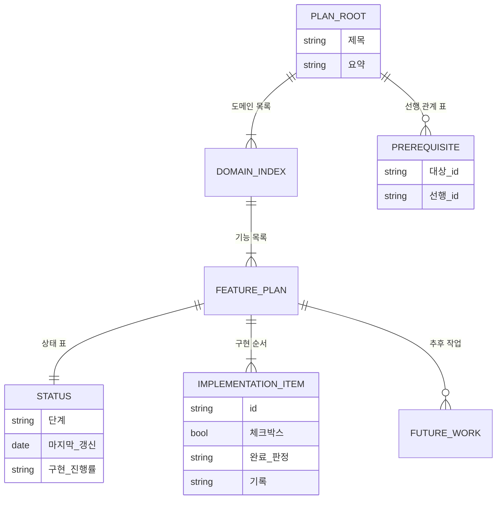
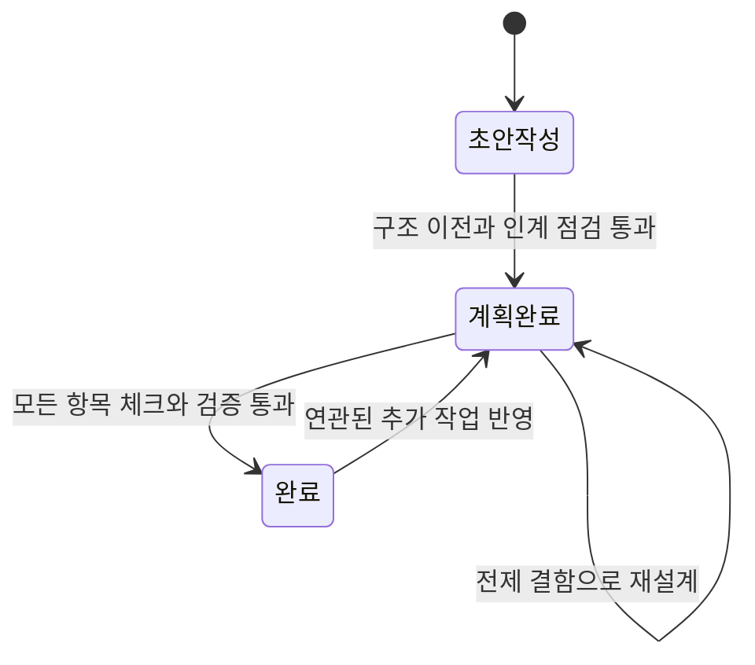

# 계획_관리(plan-management) — 도메인 모델

## 엔티티와 값 객체

| 이름 | 구분 | 역할 |
| --- | --- | --- |
| 최상위 문서 | 엔티티 | 계획 하나를 대표한다. 도메인 목록, ID 용어 표, 선행 관계 표를 담는다 |
| 도메인 문서 | 엔티티 | 기능 목록을 담는다. 상태는 두지 않는다 |
| 기능 계획서 | 엔티티 | 상태와 구현 항목의 소유자 |
| 상태 표 | 값 객체 | 단계·마지막 갱신·구현 진행률 |
| 구현 항목 | 값 객체 | ID, 체크박스, 제목, 완료 판정, 기록 줄 |
| 선행 관계 | 값 객체 | 대상 ID와 선행 ID의 쌍 |
| 검토 표시 | 값 객체 | 결정되지 않은 자리를 가리키는 주석 |
| 추후 작업 | 값 객체 | 현재 계획과 무관한 요청의 기록 |

### 생명 주기

계획서는 단일 초안으로 태어난다. 이때 단계는 `초안 작성`, 진행률은 `0 / 0`이다.

구현 순서가 확정되면 도메인과 기능의 경계를 정하고, 위층부터 문서를 만들어 내용을 옮긴 뒤 초안을 삭제한다. 인계 점검까지 마치면 단계가 `계획 완료`로 바뀌며, 이 상태가 `impl-plan`의 진입 조건이다.

구현이 시작되면 마지막 갱신 날짜가 현재 날짜로 바뀌지만 단계는 `계획 완료`로 유지된다. 항목을 마칠 때마다 체크박스·진행률·마지막 갱신이 갱신되고 기록 줄이 붙는다. 모든 항목이 닫히고 대응하는 검증이 통과하면 단계가 `완료`로 바뀐다.

`완료` 이후에도 계획서는 사라지지 않는다. 연관된 추가 작업이 들어오면 같은 문서를 고치고 단계를 `계획 완료`로 되돌려 다시 구현 단계로 보낸다. 구현 중 설계 전제가 깨지면 단계를 그대로 둔 채 `create-plan`으로 돌려보낸다.

## 데이터베이스 스키마

해당 없음. 계획서는 마크다운 파일이며 별도의 저장소나 데이터베이스에 기록되지 않는다. 아래는 파일 안의 구조가 지켜야 할 형식이다.

### 기능 계획서

| 필드 | 타입 | 제약 조건 | 설명 |
| --- | --- | --- | --- |
| 경로 | path | `<보관 경로>/YYYY-MM-DD-<주제>/<도메인>/<기능>.md` | 도메인 바로 아래여야 하며 하위 디렉터리를 가질 수 없다 |
| `단계` | string | `초안 작성` \| `계획 완료` \| `완료` | 이 세 값 외에는 검증에서 실패한다 |
| `마지막 갱신` | date | `YYYY-MM-DD` | |
| `구현 진행률` | string | `[0-9]+ / [0-9]+` | 뒤 숫자는 구현 항목 수와 일치한다 |
| 구현 항목 | list | `(- \| N. )[ x] **[A-Z0-9]+-[A-Z0-9]+-[0-9]{3}** 제목` | 최소 한 개 이상 |
| 검토 표시 | comment | 확정 시 0건 | `<!-- 사용자 검토 필요 -->` |

### 최상위 문서

| 필드 | 타입 | 제약 조건 | 설명 |
| --- | --- | --- | --- |
| 경로 | path | `<계획 디렉터리>/README.md` | 필수 |
| ID 용어 표 | table | 도메인 코드와 뜻 | 세 조각 ID의 첫 조각을 해설한다 |
| 선행 관계 표 | table | 대상 ID와 선행 ID | `impl-plan`이 읽기만 하고 쓰지 않는다 |

### 인덱스와 제약

| 대상 | 종류 | 이유 |
| --- | --- | --- |
| 도메인 디렉터리 | 존재 제약 | 최소 하나 있어야 계획 디렉터리로 인정된다 |
| 도메인 `README.md` | 존재 제약 | 기능 목록의 소유자 |
| 기능 계획서의 하위 디렉터리 | 금지 제약 | 세 층을 넘는 계층을 막는다 |
| 선행 ID | 참조 제약 | 앞 두 조각으로 다른 도메인의 기능 계획서를 찾을 수 있어야 한다 |
| 보관 경로 | `.gitignore` 등록 | 계획서를 커밋하지 않는다 |
