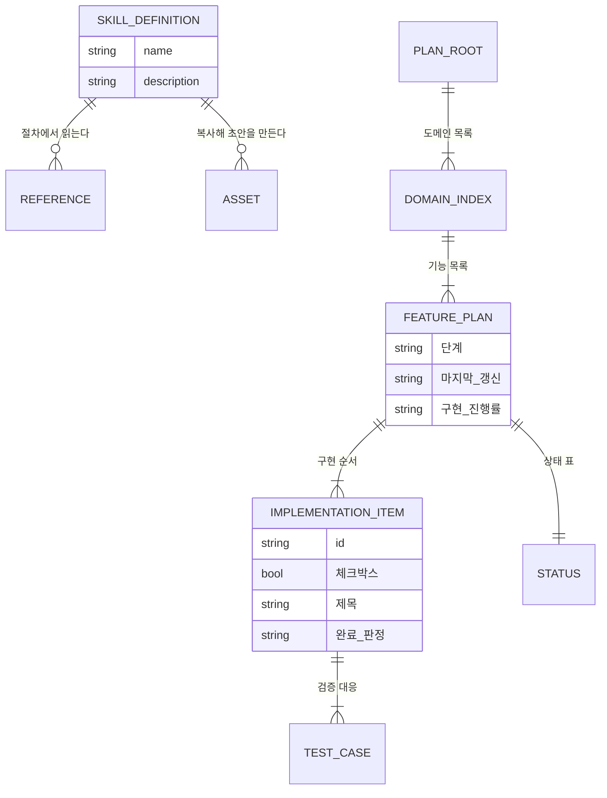

# 계획_작성(create-plan) — 도메인 모델

## 엔티티와 값 객체

이 도메인의 실체는 데이터베이스 레코드가 아니라 파일이다. 스킬 정의와 참조 문서는 `plugins/project-helper/skills/create-plan/` 아래에 있고, 산출물인 계획서는 프로젝트의 계획서 보관 경로에 생긴다.

| 이름 | 구분 | 역할 |
| --- | --- | --- |
| `SKILL.md` | 엔티티 | 실행 절차와 분기를 담는 정본. 스킬이 켜질 때 통째로 읽힌다 |
| `references/` 하위 문서 16편 | 엔티티 | 근거·예외·형식 예시. 지정된 절차에 진입할 때만 읽는다 |
| `assets/plan-template.md` | 값 객체 | 기능 계획서 양식. 요약·상태·설계·구현 순서·테스트 다섯 섹션을 가진다 |
| `assets/index-template.md` | 값 객체 | 최상위·도메인 문서 양식. ID 용어 표와 선행 관계 표를 가진다 |
| 기능 계획서 | 엔티티 | 산출물. 상태를 관리하는 유일한 층이다 |
| 구현 항목 | 값 객체 | `DOMAIN-FEATURE-001` 형식의 ID, 체크박스, 제목, 완료 판정으로 구성된다 |
| 상태 표 | 값 객체 | 단계, 마지막 갱신, 구현 진행률 세 행 |

### 생명 주기

계획서는 준비 단계에서 `assets/plan-template.md`를 복사한 초안 `YYYY-MM-DD-<주제>.md` 한 편으로 생긴다. 초안이 자라는 동안 단계는 `초안 작성`이다.

구현 순서가 정해지면 4-1단계에서 도메인과 기능의 경계를 정하고, 최상위 문서부터 차례로 만들어 내용을 세 층 구조로 옮긴 뒤 초안 파일을 삭제한다. 구조 이전과 인계 점검을 마치면 단계가 `계획 완료`로 바뀌고, 이 도메인의 책임은 여기서 끝난다.

이후의 `계획 완료 → 완료` 전이는 `impl-plan`이 수행한다. 완료된 계획에 연관된 추가 작업이 들어오면 계획서를 다시 열어 설계·구현 순서·테스트를 고치고 단계를 `계획 완료`로 되돌린다. 판정 기준은 [계획_관리(plan-management)](../계획_관리%28plan-management%29/01_도메인_개요.md)에 있다.

## 데이터베이스 스키마

해당 없음. 이 플러그인은 프롬프트 문서와 셸 스크립트로만 구성되어 데이터베이스를 사용하지 않는다. 상태는 계획서 마크다운 파일 안의 표에 기록된다.

### 상태 표의 필드

| 필드 | 타입 | 제약 조건 | 설명 |
| --- | --- | --- | --- |
| `단계` | string | `초안 작성`, `계획 완료`, `완료` 중 하나 | 계획서의 진행 단계. 기능 계획서에만 둔다 |
| `마지막 갱신` | date | `YYYY-MM-DD` | 마지막으로 내용을 고친 날짜 |
| `구현 진행률` | string | `<완료 수> / <전체 수>` 형식의 정수 두 개 | 전체 수는 구현 항목 수와 일치해야 한다 |

### 인덱스와 제약

| 대상 | 종류 | 이유 |
| --- | --- | --- |
| 구현 항목 ID | 형식 제약 `[A-Z0-9]+-[A-Z0-9]+-[0-9]{3}` | 최상위 문서의 선행 관계 표가 앞 두 조각으로 기능 계획서를 찾는다 |
| 구현 항목 표기 | 형식 제약 `1. [ ] **ID** 제목 — 설명` | 번호 매김 목록으로 통일한다. 기존 계획서의 `- [ ]` 표기도 허용한다 |
| 계획서 경로 | 구조 제약 `<보관 경로>/YYYY-MM-DD-<주제>/<도메인>/<기능>.md` | 기능 계획서가 도메인 바로 아래에 있어야 `impl-plan`이 진입할 수 있다 |
| 계획서 보관 경로 | `.gitignore` 등록 | 계획서는 로컬에 두고 커밋하지 않는다 |
