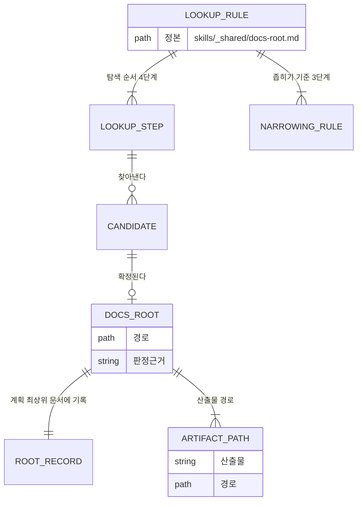

# 문서_루트_판정(docs-root) — 도메인 모델

## 엔티티와 값 객체

| 이름 | 구분 | 역할 |
| --- | --- | --- |
| 판정 규칙 | 엔티티 | `skills/_shared/docs-root.md` 한 편. 네 스킬이 공유하는 정본 |
| 탐색 단계 | 값 객체 | 네 단계 중 하나. 각 단계는 찾을 곳과 종료 조건을 가진다 |
| 후보 | 값 객체 | 탐색이 찾아낸 디렉터리 경로 |
| 좁히기 기준 | 값 객체 | 조상 기준, 이름 일치 기준, 사용자 선택 세 가지 |
| 문서 루트 | 엔티티 | 확정된 경로와 판정 근거의 쌍 |
| 루트 기록 | 값 객체 | 계획 최상위 문서의 `문서 루트` 절에 남는 표 |
| 산출물 경로 | 값 객체 | 루트에서 파생되는 계획서·PRD·개발 문서의 위치 |

### 탐색 단계

| 순서 | 찾을 곳 | 판정 |
| --- | --- | --- |
| 1 | 프로젝트 지시사항에 명시된 경로 | 있으면 그것을 쓰고 탐색을 끝낸다 |
| 2 | `글로벌_아키텍처_가이드.md`와 `도메인_문서/`가 나란히 있는 디렉터리 | 그 디렉터리가 문서 루트다 |
| 3 | `plans/` 아래에 `YYYY-MM-DD-*` 디렉터리를 가진 곳 | 그 부모를 문서 루트로 본다 |
| 4 | 어디에서도 후보가 나오지 않음 | `docs/`를 쓰고 사용자에게 알린다 |

### 좁히기 기준

| 순서 | 기준 | 적용 조건 |
| --- | --- | --- |
| 1 | 작업 대상 파일 경로의 가장 가까운 조상 | 작업 대상 코드가 정해진 스킬만 쓸 수 있다 |
| 2 | 후보 경로 이름과 요구사항의 대상 이름이 겹침 | 조상 관계로 갈리지 않을 때 |
| 3 | 사용자가 번호로 선택 | 앞 두 기준으로 좁혀지지 않을 때 |

### 생명 주기

판정은 스킬의 준비 단계에서 한 번 일어난다. 계획서를 만드는 흐름이라면 확정된 루트가 계획 최상위 문서에 기록되고, 이후 `impl-plan`과 `create-docs`는 탐색을 되풀이하지 않고 그 기록을 읽는다. 기록이 남지 않는 경우는 `create-prd`뿐이며, PRD는 계획서와 독립적으로 만들어지므로 실행할 때마다 판정한다.

기록된 루트가 현재 저장소에 없으면 판정 결과를 신뢰할 수 없으므로 진행을 멈춘다.

## 데이터베이스 스키마

해당 없음. 이 도메인의 상태는 마크다운 문서와 디렉터리 구조로만 표현된다.

### 루트 기록의 형식

계획 최상위 문서의 `문서 루트` 절에 표 하나로 남는다. 양식은 `create-plan`의 `assets/index-template.md`에 있다.

| 필드 | 타입 | 제약 조건 | 설명 |
| --- | --- | --- | --- |
| 문서 루트 | path | 저장소 루트 기준 상대 경로 | 확정한 경로. 예를 들어 `docs/project-helper` |
| 판정 근거 | string | 네 값 중 하나 | 프로젝트 지시사항, 개발 문서 위치, 계획서 위치, 사용자 선택 |

### 산출물 경로

| 산출물 | 경로 | 커밋 여부 |
| --- | --- | --- |
| 계획서 | `<루트>/plans/YYYY-MM-DD-<주제>/` | 커밋하지 않는다. `.gitignore`에 등록한다 |
| PRD | `<루트>/prds/YYYY-MM-DD-<주제>.md` | 커밋하지 않는다. `.gitignore`에 등록한다 |
| 개발 문서 | `<루트>` 바로 아래 | 커밋한다 |

## 인덱스와 제약

| 대상 | 종류 | 이유 |
| --- | --- | --- |
| 탐색 깊이 | 저장소 루트에서 네 단계 | 저장소 전체를 훑으면 느리고, 문서 루트가 그보다 깊이 놓이는 경우는 드물다 |
| 탐색 제외 대상 | `.git`, `node_modules`, 빌드 산출물 | 생성물 안에 복사된 문서가 후보로 잡히면 잘못된 루트를 고른다 |
| 정본의 위치 | `skills/` 아래 | 설치본에 복사되는 것은 `.claude-plugin`, `.codex-plugin`, `skills/`뿐이므로 그 밖에 두면 참조가 끊긴다 |
| 디렉터리 이름 | `_shared` | 밑줄 접두사가 스킬이 아님을 드러내고, `SKILL.md`가 없어 스킬 로더가 건너뛴다 |
