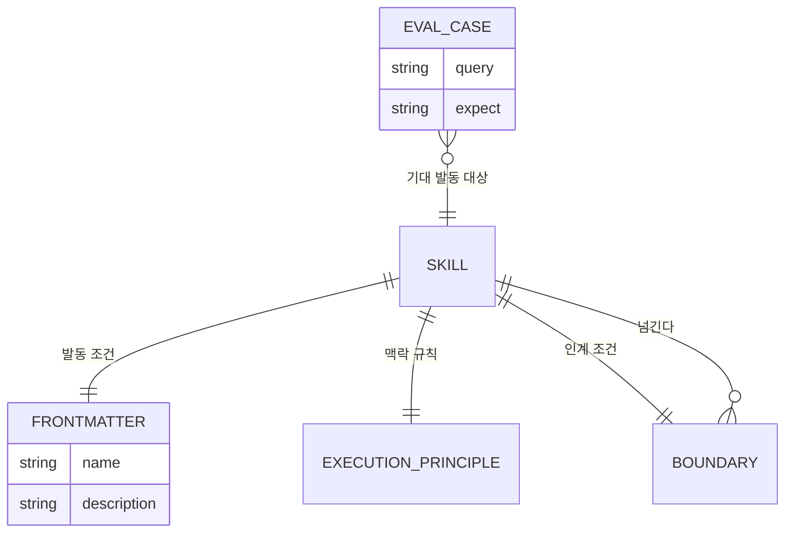
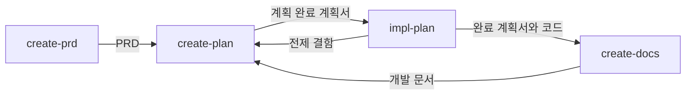

# 스킬_실행_맥락(skill-trigger) — 도메인 모델

## 엔티티와 값 객체

| 이름 | 구분 | 역할 |
| --- | --- | --- |
| 스킬 | 엔티티 | `create-prd`, `create-plan`, `impl-plan`, `create-docs` 네 개 |
| frontmatter | 값 객체 | `name`과 `description`. 발동 여부를 좌우하는 유일한 선언 |
| 실행 원칙 | 값 객체 | 명시 호출 시의 해석, 설명 요청의 예외, 맥락 유지 범위를 담은 문단 |
| 경계 | 값 객체 | 이 스킬이 맡지 않는 요청과 넘길 대상 |
| 발동 사례 | 값 객체 | `evals/trigger-eval.json`의 `query`와 `expect` 쌍 |

### 생명 주기

실행 맥락은 스킬이 발동하거나 명시 호출될 때 열린다. 열린 맥락은 후속 답변을 그 스킬의 입력으로 해석하며, 다음 세 조건 가운데 하나가 성립하면 닫힌다.

| 종료 조건 | 다음 상태 |
| --- | --- |
| 해당 작업이 끝난다 | 맥락 없음 |
| 사용자가 다른 스킬을 명시한다 | 그 스킬의 맥락으로 전환 |
| 사용자가 일반 질문을 명시한다 | 맥락 없음 |

설명 요청은 맥락을 열지도 닫지도 않는다. 일반 답변을 제공한 뒤 이전 상태를 그대로 유지한다.

네 스킬은 산출물을 통해 한 방향으로 이어진다.

## 데이터베이스 스키마

해당 없음. 실행 맥락은 대화 안에서만 유지되며 어디에도 저장되지 않는다. 지속되는 것은 각 스킬 파일의 선언과 평가 사례 파일뿐이다.

### `plugins/project-helper/skills/<스킬>/SKILL.md`

| 필드 | 타입 | 제약 조건 | 설명 |
| --- | --- | --- | --- |
| `name` | string | frontmatter 필수 | 슬래시 명령 이름과 일치한다 |
| `description` | string | frontmatter 필수 | 발동 상황과 사용하지 않을 상황을 모두 담는다 |
| 실행 원칙 | section | 필수 | 명시 호출 해석, 설명 요청 예외, 맥락 유지 범위 |
| 경계 | section | 필수 | 넘길 대상 스킬을 이름으로 밝힌다 |

### `evals/trigger-eval.json`

| 필드 | 타입 | 제약 조건 | 설명 |
| --- | --- | --- | --- |
| `plugin` | string | 필수 | 대상 플러그인 이름 |
| `note` | string | 필수 | 측정 방법 |
| `cases[].query` | string | 필수 | 사용자가 던지는 자연어 요청 |
| `cases[].expect` | string | 스킬 이름 또는 발동하지 않음 | 기대하는 발동 결과 |

### 인덱스와 제약

| 대상 | 종류 | 이유 |
| --- | --- | --- |
| `name` | 유일 제약 | 슬래시 명령이 하나의 스킬로만 해석되어야 한다 |
| `description`의 부정 조건 | 서술 제약 | 근접 요청이 잘못된 스킬로 들어가는 것을 막는다 |
| 실행 원칙 문단 | 일관성 제약 | 네 스킬이 같은 구조의 문장으로 맥락 규칙을 선언한다 |
