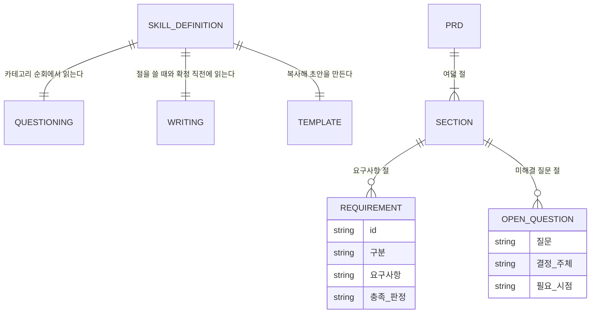

# 요구사항_정의(create-prd) — 도메인 모델

## 엔티티와 값 객체

| 이름 | 구분 | 역할 |
| --- | --- | --- |
| `SKILL.md` | 엔티티 | 준비·순회·확정 세 단계의 절차와 분기 |
| `references/questioning.md` | 엔티티 | 여덟 카테고리의 첫 질문과 넘어갈 조건 |
| `references/writing.md` | 엔티티 | 서술 규칙 일곱 가지와 확정 전 점검 목록 열한 항목 |
| `assets/prd-template.md` | 값 객체 | 여덟 절을 가진 문서 양식 |
| PRD | 엔티티 | 산출물. `YYYY-MM-DD-<주제>.md` 한 편 |
| 요구사항 | 값 객체 | ID, 구분, 내용, 충족 판정 네 열 |
| 미해결 질문 | 값 객체 | 질문, 결정 주체, 필요 시점 세 열 |

### 생명 주기

PRD는 준비 단계에서 양식을 복사한 초안으로 생긴다. 카테고리를 하나씩 닫을 때마다 해당 절이 채워지고, 그 내용을 사용자에게 한두 줄로 알린다.

여덟 카테고리를 모두 돌면 확정 단계로 넘어간다. 검증 스크립트와 점검 목록을 모두 통과하고 미해결 질문이 남아 있지 않을 때만 확정된다. 미해결 항목을 남긴 채 마무리하면 문서에 초안임을 표시한 상태로 남는다.

확정된 PRD는 이후 `create-plan`이 요구사항의 근거로, `create-docs`가 도메인의 목적과 용어의 근거로 읽는다. 다만 두 스킬 모두 PRD의 경로를 산출물에 남기지 않는다.

## 데이터베이스 스키마

해당 없음. PRD는 마크다운 파일 한 편이며 `<루트>/prds/`에 보관하되 커밋하지 않는다.

### PRD 문서

| 필드 | 타입 | 제약 조건 | 설명 |
| --- | --- | --- | --- |
| 경로 | path | `<루트>/prds/YYYY-MM-DD-<주제>.md` | `<루트>`는 문서 루트 판정 결과다 |
| 절 | section | 여덟 개 필수 | 한 줄 요약, 배경과 문제, 목적과 목표, 사용자와 사용 상황, 요구사항, 범위 밖, 제약과 전제, 미해결 질문 |
| 검토 표시 | comment | 확정 시 0건 | `<!-- 사용자 검토 필요 -->` |

### 요구사항 표

| 필드 | 타입 | 제약 조건 | 설명 |
| --- | --- | --- | --- |
| `ID` | string | `R[0-9]+` | 문서 안에서 유일하다 |
| `구분` | enum | `필수` \| `선택` | 검증 스크립트가 이 두 값만 인정한다 |
| `요구사항` | string | NOT NULL | 무엇이 가능해야 하는가 |
| `충족 판정` | string | NOT NULL | 무엇을 보면 충족된 줄 아는가 |

### 제약과 전제 표

| 필드 | 타입 | 제약 조건 | 설명 |
| --- | --- | --- | --- |
| `구분` | enum | 기술, 일정, 조직, 전제 | 네 구분 각각에 내용 또는 "해당 없음"이 채워져야 한다 |
| `내용` | string | NOT NULL | |

### 인덱스와 제약

| 대상 | 종류 | 이유 |
| --- | --- | --- |
| 여덟 절 제목 | 형식 제약 | 검증 스크립트가 `## <절 이름>` 완전 일치로 찾는다 |
| 요구사항 행 | 형식 제약 `^\| R[0-9]+ \| (필수\|선택) \|` | 구분 없는 요구사항을 막는다 |
| 미해결 질문 표의 행 수 | 확정 제약 | 머리글 행 외에 남은 행이 있으면 확정할 수 없다 |
| 보관 경로 | `.gitignore` 등록 | PRD를 커밋하지 않는다 |
