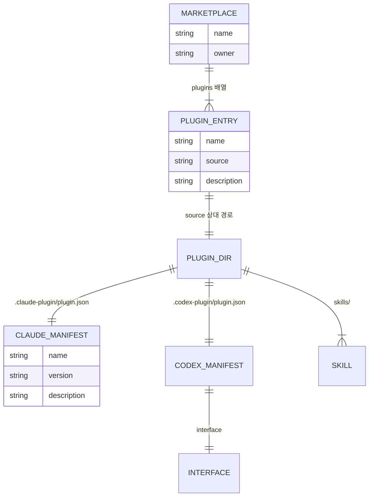

# 배포와_설치(distribution) — 도메인 모델

## 엔티티와 값 객체

| 이름 | 구분 | 역할 |
| --- | --- | --- |
| 마켓플레이스 매니페스트 | 엔티티 | 이름 `project-helpers`, 소유자, 플러그인 목록 |
| 플러그인 항목 | 값 객체 | 이름 `project-helper`, 소스 `./plugins/project-helper`, 설명 |
| Claude Code 매니페스트 | 엔티티 | 이름·버전·설명·저자·키워드 |
| Codex 매니페스트 | 엔티티 | 위 필드에 `skills` 경로와 `interface` 블록이 더해진다 |
| `interface` | 값 객체 | 표시 이름, 짧은 설명, 긴 설명, 저자, 분류, 기능, 예시 요청 네 줄 |
| 스킬 디렉터리 | 엔티티 | 설치본에 복사되는 실체 |

### 생명 주기

배포는 두 매니페스트의 버전을 올리는 데서 시작한다. 변경을 기본 브랜치에 올리고 버전 태그를 붙이면, 사용자는 저장소 주소로 마켓플레이스를 등록한 뒤 플러그인을 설치한다.

설치가 일어나면 Claude Code는 마켓플레이스 저장소 전체를 `~/.claude/plugins/marketplaces/<이름>/`에 클론하지만, 플러그인 캐시에는 `plugins/project-helper` 아래의 세 디렉터리만 복사한다. Codex도 같은 진입점을 읽어 로컬 소스를 캐시에 복사한다.

설치본은 갱신되지 않는다. 소스를 고쳤다면 재설치해야 하고, 재설치한 내용도 실행 중인 세션에는 적용되지 않아 세션을 다시 시작해야 한다.

## 데이터베이스 스키마

해당 없음. 배포 상태는 JSON 매니페스트와 각 환경의 플러그인 캐시로만 표현된다.

### 저장소가 갖출 파일

| 파일 | 역할 | 읽는 환경 |
| --- | --- | --- |
| `.claude-plugin/marketplace.json` | 마켓플레이스 진입점. 플러그인 이름과 소스 경로를 담는다 | Claude Code, Codex |
| `plugins/project-helper/.claude-plugin/plugin.json` | 플러그인 매니페스트. Claude Code의 버전 표시가 이 값을 따른다 | Claude Code |
| `plugins/project-helper/.codex-plugin/plugin.json` | 플러그인 매니페스트. Codex의 버전 표시와 `interface` 정보가 이 값을 따른다 | Codex |
| `plugins/project-helper/skills/` | 스킬 본체 | 양쪽 |

### `.claude-plugin/marketplace.json`

| 필드 | 타입 | 제약 조건 | 설명 |
| --- | --- | --- | --- |
| `name` | string | 필수 | 마켓플레이스 이름. 현재 값은 `project-helpers` |
| `owner.name` | string | 필수 | 소유자 표시 이름 |
| `plugins[].name` | string | 필수 | 설치 명령에서 `<플러그인>@<마켓플레이스>`의 앞부분이 된다 |
| `plugins[].source` | path | 저장소 루트 기준 상대 경로 | 현재 값은 `./plugins/project-helper` |
| `plugins[].description` | string | 필수 | 목록에 표시되는 설명 |

### `plugins/project-helper/.claude-plugin/plugin.json`

| 필드 | 타입 | 제약 조건 | 설명 |
| --- | --- | --- | --- |
| `name` | string | 필수 | `project-helper` |
| `version` | string | Codex 매니페스트와 동일 | 현재 값은 `0.4.2` |
| `description` | string | 필수 | 네 스킬 구성을 반영한다 |
| `author.name` | string | 필수 | |
| `keywords` | string[] | 필수 | `planning`, `implementation`, `verification`, `documentation` |

### `plugins/project-helper/.codex-plugin/plugin.json`

| 필드 | 타입 | 제약 조건 | 설명 |
| --- | --- | --- | --- |
| 위 다섯 필드 | | Claude Code 매니페스트와 동일한 값 | |
| `skills` | path | 필수 | `./skills/` |
| `interface.displayName` | string | 필수 | `Project Helper` |
| `interface.shortDescription` | string | 필수 | 목록에 표시되는 한 줄 |
| `interface.longDescription` | string | 필수 | 네 스킬의 흐름을 설명한다 |
| `interface.category` | string | 필수 | `Developer Tools` |
| `interface.capabilities` | string[] | 필수 | `Interactive`, `Write` |
| `interface.defaultPrompt` | string[] | 네 줄 | 스킬마다 하나씩 대응하는 예시 요청 |

### 인덱스와 제약

| 대상 | 종류 | 이유 |
| --- | --- | --- |
| 두 매니페스트의 `version` | 동기화 제약 | 환경마다 다른 파일을 읽으므로 어긋나면 같은 소스가 다른 버전으로 보인다 |
| `version` | 형식 제약 | 타임스탬프를 덧붙이지 않는다. 저장소의 실제 버전과 어긋난다 |
| `source` | 경로 제약 | 상대 경로여야 원격으로 옮겨도 동작한다 |
| `.gitignore` | 정합 제약 | 남은 규칙이 모두 실제로 생성되는 경로에 대응해야 한다 |
