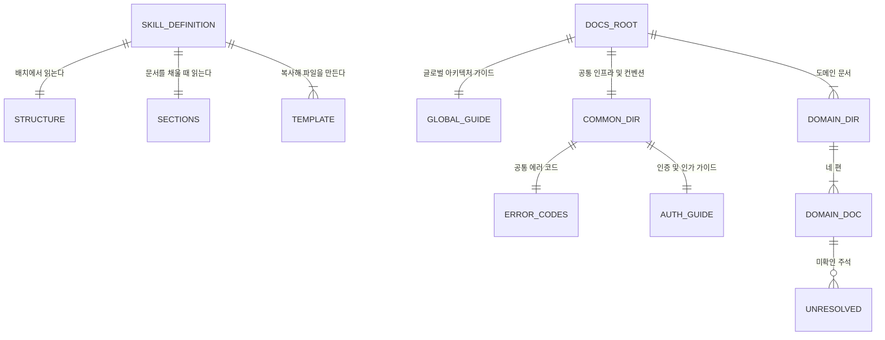

# 개발문서_생성(create-docs) — 도메인 모델

## 엔티티와 값 객체



| 이름 | 구분 | 역할 |
| --- | --- | --- |
| `SKILL.md` | 엔티티 | 진입 조건부터 확정까지 다섯 단계의 절차와 분기 |
| `references/structure.md` | 엔티티 | 보관 경로, 세 층 배치, 계획서 도메인과의 대응 규칙 |
| `references/sections.md` | 엔티티 | 문서별 필수 항목, 입력의 우선순위, 서술 규칙, 미확인 표기 |
| `assets/` 양식 일곱 편 | 값 객체 | 도메인 문서 네 편과 상위 두 층 세 편 |
| 보관 경로 | 엔티티 | 산출물이 놓이는 최상위 디렉터리 |
| 도메인 디렉터리 | 엔티티 | 계획서의 도메인 하나에 대응한다 |
| 미확인 주석 | 값 객체 | 확정을 막는 표시 |

### 생명 주기

문서는 계획서의 단계가 모두 `완료`로 확인된 뒤에 생긴다. 배치를 정해 사용자에게 확인받고, 도메인을 순회하며 네 편씩 채우고, 도메인 문서가 모두 끝난 뒤 상위 두 층을 쓴다.

확정은 세 가지를 모두 통과할 때만 이루어진다. 검증 스크립트가 필수 파일과 절 구성을 통과시키고, 미확인 주석이 남아 있지 않으며, 어긋난 지점이 사용자에게 보고된 상태다.

문서에는 갱신 개념이 없다. 다시 실행하면 대상 전체를 재생성하며, 덮어쓰기 전에 대상 목록을 보이고 동의를 받는다. 확정된 문서는 이후 `create-plan`의 준비 단계에서 다시 읽힌다.

## 데이터베이스 스키마

해당 없음. 산출물은 마크다운 파일이며 데이터베이스를 쓰지 않는다. 아래는 파일 배치가 지켜야 할 구조다.

### 보관 경로의 구조

```
<보관 경로>/
├── 글로벌_아키텍처_가이드.md
├── 공통_인프라_및_컨벤션/
│   ├── 공통_에러_코드.md
│   └── 인증_및_인가_가이드.md
└── 도메인_문서/
    └── <도메인 이름>/
        ├── 01_도메인_개요.md
        ├── 02_도메인_모델.md
        ├── 03_API_명세.md
        └── 04_도메인_특화_가이드.md
```

공통 층에는 필수 두 편 외에 프로젝트 전반에 적용되는 기준 문서를 함께 둘 수 있다. 이 저장소에는 문서 작성 기준과 프롬프트 작성 가이드가 더해져 네 편이 있다.

| 필드 | 타입 | 제약 조건 | 설명 |
| --- | --- | --- | --- |
| 보관 경로 | path | 지시사항의 지정, 없으면 `docs/` | 이 저장소는 `plugins/project-helper/docs/`를 쓴다 |
| `글로벌_아키텍처_가이드.md` | file | 필수 | 여섯 절을 가진다 |
| `공통_인프라_및_컨벤션/` | dir | 필수 | 두 파일을 가진다 |
| `도메인_문서/` | dir | 필수 | 도메인 디렉터리를 최소 하나 가진다 |
| 도메인 디렉터리 이름 | string | 계획서의 도메인 이름 | 영문 코드뿐이면 `한글_이름(code)` 형태로 짓는다 |

### 문서별 필수 절

| 문서 | 필수 절 |
| --- | --- |
| 글로벌 아키텍처 가이드 | 시스템 개요, 도메인 구성, 기술 스택, 인프라, 공통 보안 원칙, 공통 컨벤션 |
| 공통 에러 코드 | 에러 응답 형식, 공통 코드 목록, 도메인별 코드 규칙 |
| 인증 및 인가 가이드 | 인증 방식, 인가 규칙, 실패 처리 |
| `01_도메인_개요.md` | 도메인 정의, 유비쿼터스 용어 사전, 핵심 비즈니스 규칙 |
| `02_도메인_모델.md` | 엔티티와 값 객체, 데이터베이스 스키마 |
| `03_API_명세.md` | 엔드포인트 목록, 이벤트 메시징 |
| `04_도메인_특화_가이드.md` | 외부 의존성, 핵심 테스트 시나리오, 트러블슈팅 |

### 인덱스와 제약

| 대상 | 종류 | 이유 |
| --- | --- | --- |
| 절 제목 | 형식 제약 `^#{2,3} <절 이름>` | 검증 스크립트가 2단계와 3단계 헤더에서만 찾는다 |
| 미확인 주석 | 금지 제약 | 확정된 문서에는 하나도 없어야 한다 |
| 도메인 디렉터리 | 존재 제약 | 하나도 없으면 검증이 실패한다 |
| 계획서 도메인과의 대응 | 참조 제약 | 문서 디렉터리 하나가 계획서 도메인 하나에 대응한다 |
