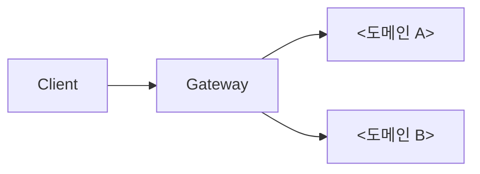

# <프로젝트 이름> — 글로벌 아키텍처 가이드

## 시스템 개요

<이 시스템이 무엇을 하는 서비스이고 어떤 단위로 나뉘어 있는지 두세 문장으로 쓴다.>

## 도메인 구성

| 도메인 | 책임 | 문서 |
| --- | --- | --- |
| <도메인 이름> | <무엇을 맡는가> | [`도메인_문서/<디렉터리>/`](도메인_문서/<디렉터리>/01_도메인_개요.md) |

### 도메인 간 통신

| 호출자 | 피호출자 | 방식 | 목적 |
| --- | --- | --- | --- |
| <도메인> | <도메인> | 동기 HTTP / 이벤트 | <무엇을 위해> |

## 기술 스택

| 계층 | 사용 기술 | 비고 |
| --- | --- | --- |
| <언어·런타임> | <값> | <버전이나 제약> |
| <프레임워크> | <값> | |
| <데이터 저장소> | <값> | |

## 인프라

<배포 단위, 실행 환경, 환경 구분(개발·스테이징·운영)을 쓴다.>

| 항목 | 내용 |
| --- | --- |
| 배포 방식 | <어떻게 배포되는가> |
| 환경 구분 | <어떤 환경이 있는가> |
| 로그와 모니터링 | <어디서 보는가> |

## 공통 보안 원칙

<인증·인가의 세부 규칙은 [`공통_인프라_및_컨벤션/인증_및_인가_가이드.md`](공통_인프라_및_컨벤션/인증_및_인가_가이드.md)에 둔다. 여기에는 시스템 전반에 적용되는 원칙만 쓴다.>

1. <원칙과 그 적용 범위>

## 공통 컨벤션

| 대상 | 규칙 |
| --- | --- |
| API 경로 | <규칙> |
| 에러 응답 형식 | [`공통_에러_코드.md`](공통_인프라_및_컨벤션/공통_에러_코드.md) 참조 |
| 명명 규칙 | <규칙> |

<!-- 미확인: <무엇을 확인하지 못했는가> -->
