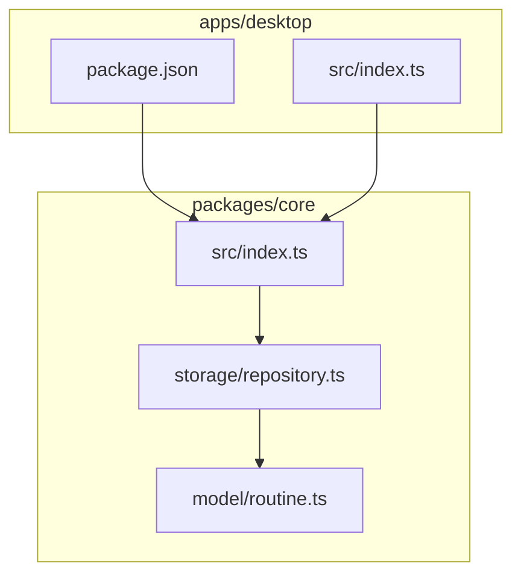

# 문서 구성

## 목적

학습 문서가 어떤 절을 어떤 순서로 담고, 각 절을 어느 깊이로 쓰는지 정합니다.

## 핵심 지시

일곱 절을 고정된 순서로 쓰고, 절마다 판정 기준을 만족할 때까지 채웁니다.

## 절 구성

| 순서 | 절 | 담는 것 | 채워진 줄 아는 기준 |
| --- | --- | --- | --- |
| 1 | 한 줄 요약 | 이 커밋이 무엇을 바꿨는지 한 문장 | 이 문장만 읽고 커밋의 대상과 변화를 말할 수 있다 |
| 2 | 변경 전 상태와 문제 | 직전 코드가 어떻게 동작했고 무엇이 한계였으며 어떤 환경을 전제했는지 | 변경 전 동작과 그 한계, 전제한 실행 환경이 각각 서술되어 있다 |
| 3 | 변경 의도 | 왜 그렇게 바꿨는지와 그 근거 | 의도 서술마다 근거가 된 커밋 메시지나 계획서가 함께 적혀 있다 |
| 4 | 구성 요소 | 뒤 두 절에 나오는 코드 식별자의 정체 | 실행 흐름과 의존 관계에 등장하는 식별자 중 표에 없는 것이 없다 |
| 5 | 실행 흐름 | 입력부터 결과까지의 단계 | 단계마다 파일과 함수 이름이 붙어 있고, 이 커밋으로 달라진 단계가 표시되어 있다 |
| 6 | 의존 관계 | 구성 요소 사이의 연결 | mermaid 블록이 있고, 화살표마다 하위가 상위에 대해 알아야 하는 지식이 문장으로 적혀 있다 |
| 7 | 용어와 배경 | 본문에 나온 개념의 뜻 | 본문의 전문 용어 중 표에 없는 것이 없다 |

절의 순서를 바꾸거나 절을 더하지 않습니다. 문서를 나란히 놓고 같은 자리를 찾아 읽기 위해서입니다.

## 설명의 깊이

### 변경 전 상태와 문제

동작과 한계에 더해, 그 코드가 어떤 환경에서 쓰이도록 만들어졌는지 한 줄로 적습니다. 전제한 실행 환경은 코드에 드러나지 않는 경우가 많고, 나중에 문서만 읽을 때 판단의 근거가 됩니다.

전제로 적을 것은 그 커밋이 가정한 실행 조건입니다. 패키지 매니저와 워크스페이스 구성, 런타임, 호출하는 쪽의 종류가 그런 예입니다.

### 구성 요소

이 절은 뒤 두 절을 읽기 전에 이름의 정체를 알려 주는 자리입니다. 관계부터 설명하면 읽는 사람이 이름을 되짚어 찾게 되므로, 실행 흐름과 의존 관계보다 앞에 둡니다.

요소마다 이름, 종류, 위치, 역할을 표의 한 행으로 적습니다.

| 열 | 담는 것 |
| --- | --- |
| 구성 요소 | 코드에 쓰인 이름 그대로 |
| 종류 | 타입, 인터페이스, 함수, 설정 파일처럼 무엇인지와 공개 범위 |
| 어디에 | 그 이름이 선언된 파일 |
| 역할 | 이 커밋의 맥락에서 무엇을 맡는지 한 줄 |

종류 열은 무엇인지에 더해 공개 범위를 함께 적습니다. 소비자에게 노출되는 기능과 감춰진 구현 결정을 가르기 위해서입니다. 이 표기가 있으면 인터페이스를 바꾼 커밋과 내부 구현만 바꾼 커밋이 문서에서 구분됩니다.

| 표기 | 판정 |
| --- | --- |
| `<종류> · 공개` | 패키지나 모듈 바깥에서 이름으로 가져다 쓸 수 있는 요소 |
| `<종류> · 내부` | 선언된 파일이나 패키지 안에서만 쓰이는 요소 |

시그니처나 선언을 인용하지 않습니다. 이 절은 훑어보고 위치를 잡는 자리이며, 인용은 분량만 늘립니다.

담는 범위는 실행 흐름과 의존 관계에 등장하는 코드 식별자로 한정합니다. 커밋이 건드리지 않은 인접 요소라도 뒤 두 절에 나오면 함께 적습니다.

### 실행 흐름

파일 목록을 나열하지 않고, 입력이 들어와 결과가 나올 때까지를 순서로 추적합니다. 단계마다 어느 파일의 어느 함수에서 일어나는지 밝힙니다.

이 커밋으로 달라진 단계는 표시로 구분해, 변경 전 흐름과 대비되게 씁니다.

표에는 복잡성의 출처를 적는 열을 함께 둡니다. 그 단계의 복잡성이 요구사항에서 온 것인지 설계 편의에서 온 것인지를 남기는 자리입니다.

| 값 | 판정 |
| --- | --- |
| `필수적 복잡성` | 커밋 메시지나 계획서가 비즈니스 규칙이나 요구사항을 이유로 밝힌 단계 |
| `우발적 복잡성` | 커밋 메시지나 계획서가 설계나 구현 편의를 이유로 밝힌 단계 |
| 빈 셀 | 세 근거 어디에도 이유가 적혀 있지 않은 단계 |

**근거가 밝힌 자리에만 채우고, 그 밖에는 비워 둡니다.** 이 스킬은 코드의 품질을 평가하지 않으므로, 어느 쪽인지 판단해서 고르는 일은 하지 않습니다. 대부분의 단계에서 이 열은 비어 있는 것이 정상입니다.

### 의존 관계

바뀐 구성 요소만 그리지 않습니다. 그 요소가 연결되는 주변까지 포함해, 변경이 어디에 닿는지 보이게 합니다. 다이어그램에는 커밋이 건드리지 않은 인접 요소가 최소 하나 들어갑니다.

구조를 재배치한 커밋에서는 변경 전과 변경 후를 각각 그립니다. 파일을 쪼개면 구성 요소 하나의 복잡성은 줄고 요소 사이의 연결은 늘어나는데, 그림 한 장으로는 이 교환이 보이지 않기 때문입니다.

| 커밋의 성격 | 다이어그램 |
| --- | --- |
| 구성 요소를 쪼개거나 합쳤다 | 변경 전과 변경 후 두 장 |
| 요소 사이의 연결 방향을 바꿨다 | 변경 전과 변경 후 두 장 |
| 그 밖의 변경 | 변경 후 한 장 |

두 장을 그릴 때는 각 그림 앞에 무엇을 그린 것인지 밝히고, 두 그림을 비교해 무엇이 늘고 무엇이 줄었는지 문장으로 적습니다.

다이어그램은 mermaid로 그리며, 방향은 `flowchart TD`로 고정합니다. 위에서 아래로 흐르는 배치에서 아래쪽에 상위 요소를 둡니다. 상위는 다른 요소가 가져다 쓸 지식을 제공하는 쪽이고, 하위는 그 지식을 알고 있어야 하는 쪽입니다. 배치를 고정하면 화살표를 하나씩 세지 않고도 결합의 방향이 읽힙니다.

패키지나 모듈처럼 요소를 묶는 경계가 있으면 `subgraph`로 감쌉니다. 경계 안쪽의 연결과 경계를 넘는 연결이 갈려 보여야, 요소를 나눈 대가가 어디로 갔는지 알 수 있습니다.

그림만 두지 않고, 화살표마다 어떤 의존인지 문장으로 설명합니다.

화살표 설명은 호출 여부에 그치지 않고, 화살표가 시작하는 쪽이 도착하는 쪽에 대해 무엇을 알고 있어야 하는지 밝힙니다. 두 요소가 공유하는 지식의 양이 곧 결합의 강도이므로, 그것을 적어야 같은 그림이 변경의 파급과 함께 결합의 방향까지 전달합니다.

| 쓰지 않는 설명 | 쓰는 설명 |
| --- | --- |
| 진입 모듈을 호출하는 관계 | 진입 모듈이 내보내는 이름과 그 타입의 모양을 알아야 하는 관계 |
| 두 파일이 연결된 관계 | 인터페이스의 메서드 시그니처가 요구하는 도메인 타입을 알아야 하는 관계 |

### 용어와 배경

커밋에 등장한 용어와 개념만 다룹니다. 범위를 열어 두면 문서가 교재로 번져 커밋을 이해한다는 목적에서 멀어집니다.

코드 식별자는 이 절에 넣지 않습니다. 네 번째 절이 이미 맡았기 때문입니다. 이 절은 식별자가 아닌 개념과 배경 지식을 담습니다. 도메인 낱말, 표기법, 도구의 동작 방식이 그런 예입니다.

| 표에 넣을 자리 | 판정 |
| --- | --- |
| 구성 요소 | 코드에 그 이름으로 선언되거나 표기된 식별자 |
| 용어와 배경 | 코드 식별자가 아닌 개념과 배경 지식 |

보충 설명은 본문에 흩지 않고 두 표에 모읍니다. 본문을 읽는 흐름이 끊기지 않게 하기 위해서입니다.

## 예외 처리

| 예외 조건 | 할 일 |
| --- | --- |
| 커밋이 문서만 고쳐 실행 흐름이 없다 | 실행 흐름 절에 해당 없음과 그 이유를 적고 나머지 절은 채웁니다 |
| 의존 관계가 한 파일 안에서 끝난다 | 파일 내부의 함수 관계를 다이어그램으로 그립니다 |
| 커밋 메시지에 의도가 없고 계획서도 없다 | 의도를 추측하지 않고 확인 필요 표시를 남깁니다 |
| 변경 전 코드가 전제한 환경을 확인할 수 없다 | 그 자리에 확인 필요 표시를 남깁니다 |
| 요소의 공개 범위를 판정할 수 없다 | 종류만 적고 공개 범위 표기를 생략합니다 |
| 복잡성의 출처를 밝힌 근거가 없다 | 출처 열을 비워 둡니다. 둘 중 가까운 쪽으로 고르지 않습니다 |
| 커밋이 구조를 재배치했다 | 의존 관계 절에 변경 전과 변경 후 다이어그램을 나란히 둡니다 |
| 구조 재배치인지 판정하기 어렵다 | 변경 후 한 장만 그립니다. 두 장은 교환이 드러날 때만 씁니다 |
| 요소를 묶는 경계가 하나뿐이다 | `subgraph` 없이 `TD` 배치만 적용합니다 |
| 상위와 하위를 가릴 수 없는 순환 의존이다 | 배치를 억지로 맞추지 않고, 순환이라는 사실을 화살표 설명에 적습니다 |
| 변경 규모가 커서 흐름이 여러 갈래다 | 갈래마다 실행 흐름 절의 하위 항목으로 나눕니다 |
| 본문에 쓸 용어가 하나도 없다 | 용어 표에 해당 없음을 적습니다. 절을 지우지 않습니다 |
| 커밋에 코드 식별자가 하나도 없다 | 구성 요소 표에 해당 없음을 적습니다. 절을 지우지 않습니다 |
| 구성 요소가 지나치게 많다 | 실행 흐름과 의존 관계에 등장하는 것만 적습니다. 그 밖의 식별자는 넣지 않습니다 |

## 근거·예시

파일 단위로 "무엇이 바뀌었다"만 적으면 diff를 다시 열어야 흐름이 보입니다. 어느 함수가 무엇을 받아 무엇을 넘기는지 순서로 이어야, 코드를 열지 않고도 변경을 설명할 수 있습니다.

다이어그램에 바뀐 요소만 그리면 변경의 파급이 보이지 않습니다. 검증 스크립트 한 편을 추가한 커밋이라면, 그 스크립트를 부르는 스킬 문서까지 그려야 무엇이 달라졌는지 읽힙니다.
